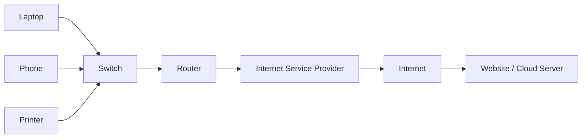
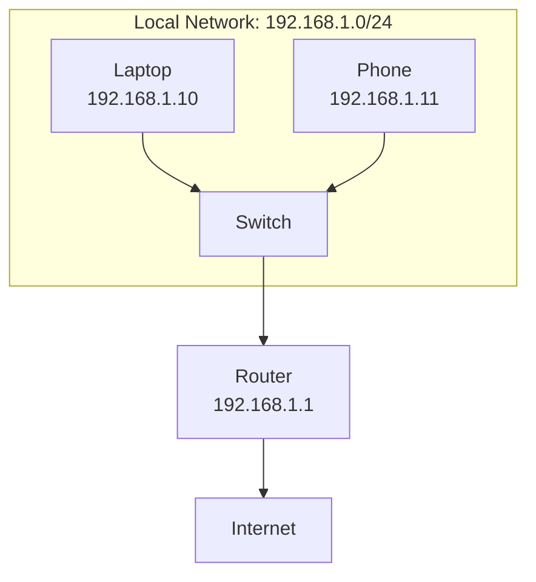

# What is Networking?

Networking is the practice of connecting devices so they can exchange data. A device can be a laptop, phone, server, printer, router, switch, firewall, virtual machine, container, or cloud service.

Without networking, each device would work alone. With networking, devices can send requests, receive responses, share files, access websites, run applications, and connect to cloud services.

## Visual Overview

## A Simple Real-World Example

When you open `www.google.com`, many networking steps happen in a few milliseconds:

1. Your laptop creates a request for the website.
2. DNS translates `www.google.com` into an IP address.
3. Your laptop sends the request to your home router.
4. Your router forwards it to your internet service provider.
5. The request travels across multiple networks.
6. Google's server receives the request and sends a response.
7. Your browser displays the web page.

Networking is the reason this request can leave your laptop, find the correct server, and return with the correct response.

## Why Networking Matters

Networking enables:

- Internet access
- Email and messaging
- Video calls
- Online banking and shopping
- Cloud computing
- DevOps pipelines
- Kubernetes clusters
- Database connections
- System monitoring
- Distributed applications

Modern software systems rarely run on one machine. Web servers, databases, load balancers, caches, APIs, and users all communicate across networks.

## Common Types of Networks

| Type | Full Name | Scope | Example |
| --- | --- | --- | --- |
| LAN | Local Area Network | Small area | Home WiFi, office network |
| WLAN | Wireless Local Area Network | Wireless LAN | WiFi network |
| MAN | Metropolitan Area Network | City or campus | University network |
| WAN | Wide Area Network | Large geographic area | The internet, corporate branch network |
| VPN | Virtual Private Network | Encrypted logical network | Remote employee connecting to office |

## Important Network Components

| Component | What It Does |
| --- | --- |
| Host | Any device that sends or receives network traffic |
| Client | A device or program that requests a service |
| Server | A device or program that provides a service |
| Switch | Connects devices inside the same local network |
| Router | Connects different networks and forwards traffic between them |
| Firewall | Allows or blocks traffic based on security rules |
| Access Point | Lets wireless devices connect to a wired network |
| Modem | Connects a home or office network to an ISP connection type |

## Switch vs Router

A switch connects devices within the same network. A router connects different networks.

If your laptop sends data to your phone on the same WiFi network, the switch or access point can handle it locally. If your laptop sends data to a website on the internet, the router must forward it outside your local network.

## Key Networking Goals

Good networks are designed around four major goals:

- Reliability: communication should work consistently.
- Availability: services should remain reachable.
- Security: only allowed traffic should pass.
- Scalability: the network should support growth without redesigning everything.

## Key Terms

| Term | Meaning |
| --- | --- |
| Packet | A small unit of data sent across a network |
| Protocol | A set of rules for communication |
| IP address | Logical address used to identify a device on a network |
| MAC address | Hardware address used inside a local network |
| Port | Number used to identify a specific application or service |
| Bandwidth | Maximum amount of data a link can carry |
| Latency | Time taken for data to travel from source to destination |

## Common Beginner Mistakes

- Thinking WiFi and internet are the same thing. WiFi connects you to a local network; the internet is a global network.
- Thinking a switch and router do the same job. Switches connect local devices; routers connect networks.
- Thinking an IP address always identifies a physical device. IP addresses can also belong to virtual machines, containers, load balancers, and cloud services.
