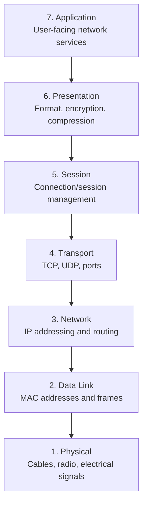
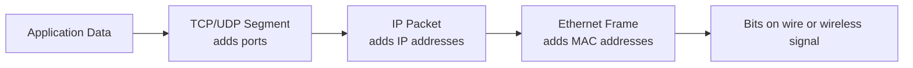

# OSI Model

The OSI model, or Open Systems Interconnection model, is a teaching model that explains how data moves across a network. It divides network communication into seven layers.

The OSI model is not a protocol by itself. It is a framework for understanding what each part of networking is responsible for.

## Visual Overview

## The Seven Layers

| Layer | Name | Main Responsibility | Examples |
| --- | --- | --- | --- |
| 7 | Application | Network services used by applications | HTTP, HTTPS, DNS, SMTP |
| 6 | Presentation | Data format, encryption, compression | TLS, encoding, serialization |
| 5 | Session | Start, maintain, and close sessions | Login sessions, RPC sessions |
| 4 | Transport | End-to-end delivery between processes | TCP, UDP, ports |
| 3 | Network | Logical addressing and routing | IPv4, IPv6, ICMP, routers |
| 2 | Data Link | Local network delivery | Ethernet, WiFi, MAC addresses, switches |
| 1 | Physical | Transmission of raw bits | Copper cable, fiber, radio signals |

## Layer 7: Application

The application layer is where user-facing network services live. It defines how applications request and provide data.

Examples:

- A browser using HTTPS to load a website
- An email client using SMTP to send email
- A computer using DNS to resolve a domain name

Important point: the application layer does not mean the user interface. It means application-level network protocols.

## Layer 6: Presentation

The presentation layer prepares data so the receiving system can understand it.

Responsibilities include:

- Encryption and decryption
- Compression and decompression
- Character encoding
- Data serialization formats

Examples include TLS encryption for HTTPS, JSON encoding, and image or video formats.

## Layer 5: Session

The session layer manages conversations between systems. It can help establish, maintain, and end communication sessions.

Examples:

- A login session in a web application
- A long-running remote procedure call
- Reconnecting or resuming a broken session

In real-world TCP/IP networks, session behavior is often handled by applications and libraries rather than a separate visible protocol layer.

## Layer 4: Transport

The transport layer manages communication between processes on two devices. It uses port numbers to identify which application should receive the data.

Common protocols:

- TCP: reliable, ordered delivery with retransmission
- UDP: faster, connectionless delivery without built-in reliability

Example:

- HTTPS usually uses TCP port `443`.
- DNS often uses UDP port `53`, though it can also use TCP.

## Layer 3: Network

The network layer moves packets between different networks. This is where IP addressing and routing happen.

Responsibilities include:

- Choosing a path to the destination network
- Forwarding packets between routers
- Using source and destination IP addresses

Devices commonly associated with this layer:

- Routers
- Layer 3 switches

## Layer 2: Data Link

The data link layer moves frames inside a local network. It uses MAC addresses to deliver traffic between devices on the same LAN.

Examples:

- Ethernet
- WiFi
- VLANs
- Switch forwarding

Layer 2 handles local delivery. If traffic needs to leave the local network, it is sent to a router.

## Layer 1: Physical

The physical layer transmits raw bits as signals.

Examples:

- Copper cable
- Fiber optic cable
- WiFi radio signals
- Network interface cards
- Connectors and electrical standards

## Encapsulation

When data is sent, each layer adds its own information. This process is called encapsulation.

When the receiver gets the data, the process is reversed. Each layer reads and removes its own header.

## Practical Troubleshooting by Layer

| Symptom | Possible OSI Layer |
| --- | --- |
| Cable unplugged or weak WiFi signal | Layer 1 |
| Wrong VLAN or MAC address issue | Layer 2 |
| Wrong IP, subnet mask, or route | Layer 3 |
| Port blocked or TCP connection failing | Layer 4 |
| TLS certificate problem | Layer 6 |
| Website returns `500` or DNS name is wrong | Layer 7 |

## Key Takeaway

The OSI model helps you break a networking problem into smaller parts. Instead of saying "the network is down", you can ask: is the physical connection working, is local delivery working, is routing correct, is the port open, and is the application responding?
