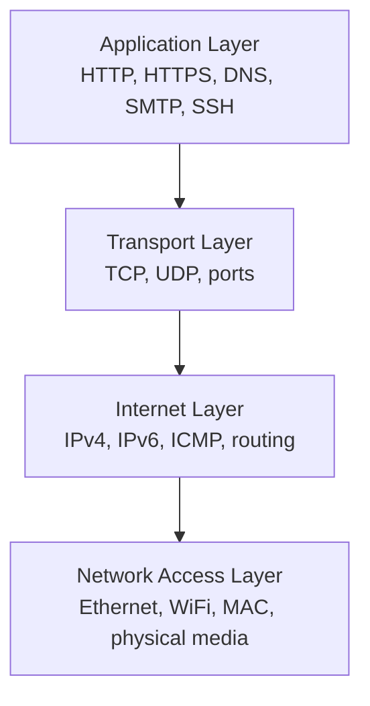
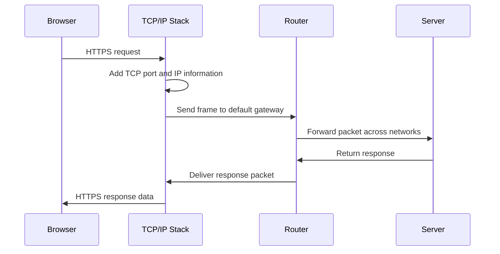

# TCP/IP Model

The TCP/IP model is the practical networking model used by the internet. While the OSI model is useful for learning and troubleshooting, TCP/IP describes the protocol stack that real systems use to communicate.

TCP/IP is usually shown as four layers.

## Visual Overview

## TCP/IP Layers

| TCP/IP Layer | Purpose | Common Examples | OSI Mapping |
| --- | --- | --- | --- |
| Application | Provides network services to applications | HTTP, HTTPS, DNS, SSH, SMTP | OSI layers 5, 6, 7 |
| Transport | Moves data between processes | TCP, UDP, port numbers | OSI layer 4 |
| Internet | Moves packets between networks | IPv4, IPv6, ICMP | OSI layer 3 |
| Network Access | Moves frames on the local network | Ethernet, WiFi, MAC addresses | OSI layers 1, 2 |

## Application Layer

The application layer defines how applications communicate over a network.

Examples:

- HTTP and HTTPS for websites and APIs
- DNS for translating domain names to IP addresses
- SSH for secure remote server access
- SMTP for sending email

When a browser loads a website, the browser is using an application-layer protocol such as HTTPS.

## Transport Layer

The transport layer delivers data to the correct process on the destination device. It uses port numbers.

For example:

- HTTPS normally uses TCP port `443`.
- SSH normally uses TCP port `22`.
- DNS often uses UDP port `53`.

### TCP

TCP, or Transmission Control Protocol, is reliable and connection-oriented.

TCP provides:

- Connection setup
- Ordered delivery
- Acknowledgements
- Retransmission of lost data
- Flow control

TCP is commonly used for web traffic, APIs, SSH, file transfers, and email.

### UDP

UDP, or User Datagram Protocol, is connectionless and lightweight.

UDP provides:

- Lower overhead than TCP
- No built-in retransmission
- No built-in ordering guarantee
- Faster delivery when occasional loss is acceptable

UDP is commonly used for DNS, streaming, voice calls, gaming, and VPN protocols.

## Internet Layer

The internet layer is responsible for addressing and routing packets between networks.

Important protocols:

- IPv4
- IPv6
- ICMP

Routers operate mainly at this layer. They inspect destination IP addresses and decide where to forward packets next.

## Network Access Layer

The network access layer handles local delivery over the physical or wireless network.

Examples:

- Ethernet
- WiFi
- MAC addresses
- Network interface cards
- Switches

This layer is responsible for getting data to the next device on the local network, such as a router or another host.

## Example: Loading a Website

## OSI vs TCP/IP

| OSI Model | TCP/IP Model |
| --- | --- |
| Seven layers | Four layers |
| Teaching and troubleshooting model | Practical internet protocol model |
| Separates application, presentation, and session | Combines them into application layer |
| Separates physical and data link | Combines them into network access layer |

## Key Takeaway

Use the OSI model to think clearly about networking responsibilities. Use the TCP/IP model to understand how real internet communication is built.
