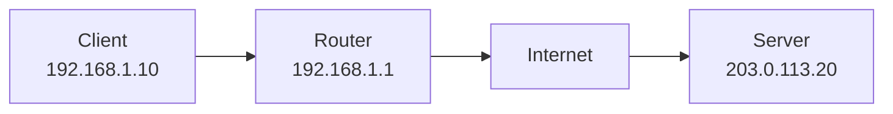
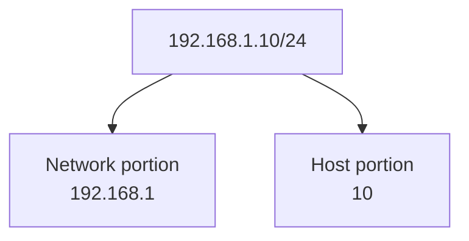

# IP Address

An IP address is a logical address used to identify a device or network interface on an IP network. IP stands for Internet Protocol.

An IP address helps network devices answer two important questions:

- Where is the destination network?
- Which device inside that network should receive the packet?

## Visual Overview



## IPv4

IPv4 is the most familiar IP address format. It is a 32-bit address written as four decimal numbers separated by dots.

Example:

```text
192.168.1.10
```

Each number is called an octet and can range from `0` to `255`.

```text
192 . 168 . 1 . 10
 |     |    |    |
octet octet octet octet
```

IPv4 has about 4.3 billion possible addresses, which is not enough for every device in the world to have a unique public address. This is one reason private IP addressing and NAT are widely used.

## IPv6

IPv6 is a 128-bit address format created to provide a much larger address space.

Example:

```text
2001:db8:1234:abcd::10
```

IPv6 addresses are written in hexadecimal and separated by colons. The `::` shorthand can replace consecutive groups of zeros, but it can appear only once in an IPv6 address.

## Network Portion and Host Portion

An IP address usually has two parts:

- Network portion: identifies the network.
- Host portion: identifies a device inside that network.

Example:

```text
192.168.1.10/24
```

In this example:

- Network address: `192.168.1.0`
- Host address: `192.168.1.10`
- CIDR prefix: `/24`
- Usable host range: usually `192.168.1.1` to `192.168.1.254`



## Why IP Addresses Matter

IP addresses are used for:

- Identifying source and destination devices
- Routing packets between networks
- Assigning devices to subnets
- Writing firewall rules
- Configuring servers, routers, and cloud resources
- Troubleshooting connectivity problems

## Public and Private IP Addresses

| Type | Meaning | Example |
| --- | --- | --- |
| Public IP | Routable on the internet | `8.8.8.8` |
| Private IP | Used inside private networks | `192.168.1.10` |

A private IP address can be reused in many homes and companies because it is not routed directly across the public internet.

## Static and Dynamic IP Addresses

| Type | Meaning | Common Use |
| --- | --- | --- |
| Static IP | Manually assigned or reserved | Servers, routers, databases |
| Dynamic IP | Automatically assigned by DHCP | Laptops, phones, temporary devices |

Most home devices receive dynamic IP addresses from the router using DHCP.

## Important Related Terms

| Term | Meaning |
| --- | --- |
| Subnet mask | Defines which part of the IP address is network vs host |
| CIDR prefix | Slash notation version of the subnet mask, such as `/24` |
| Default gateway | Router used to reach other networks |
| DNS | Translates names such as `example.com` into IP addresses |
| DHCP | Automatically gives IP configuration to devices |

## Common Beginner Mistakes

- Thinking an IP address is permanent. Many IP addresses are dynamic.
- Confusing private IP addresses with public IP addresses.
- Forgetting that a device needs a correct default gateway to reach other networks.
- Assuming DNS and IP are the same. DNS names are human-friendly labels; IP addresses are used for routing.
