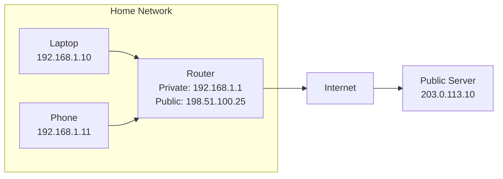
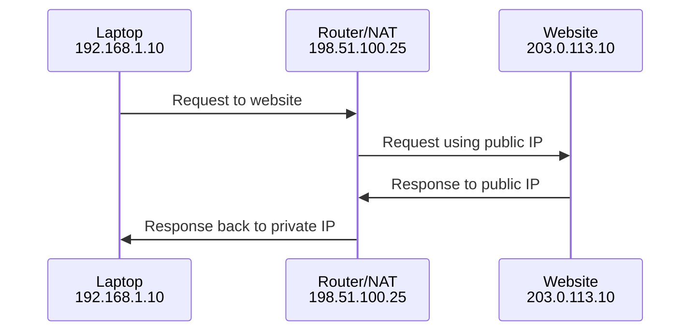

# Public IP vs Private IP

IP addresses are commonly grouped into public and private addresses.

A public IP address is reachable across the internet. A private IP address is used inside a private network and is not routed directly on the public internet.

## Visual Overview



## Public IP Address

A public IP address is globally unique and can be routed on the internet.

Public IPs are usually assigned by:

- Internet service providers
- Cloud providers
- Data center network teams

Examples:

```text
8.8.8.8
1.1.1.1
203.0.113.10
```

Public IP addresses are used for internet-facing resources such as websites, public APIs, VPN endpoints, load balancers, and DNS servers.

## Private IP Address

A private IP address is used inside a private network, such as a home LAN, office LAN, or cloud VPC.

Private IP addresses are not directly reachable from the internet. They are intended for internal communication.

Examples:

```text
10.0.1.25
172.16.5.10
192.168.1.20
```

## Private IPv4 Ranges

These ranges are reserved for private networks:

| Range | CIDR Block | Number of Addresses |
| --- | --- | --- |
| `10.0.0.0` to `10.255.255.255` | `10.0.0.0/8` | 16,777,216 |
| `172.16.0.0` to `172.31.255.255` | `172.16.0.0/12` | 1,048,576 |
| `192.168.0.0` to `192.168.255.255` | `192.168.0.0/16` | 65,536 |

## Why Private IP Addresses Exist

Private IP addresses solve two major problems:

- They reduce the need for every internal device to have a public IP address.
- They allow organizations to design internal networks independently.

Millions of homes can use `192.168.1.10` internally because private addresses are isolated inside each private network.

## NAT: How Private Devices Access the Internet

Private devices usually access the internet through NAT, or Network Address Translation.



NAT changes the source address from the private IP to the router's public IP when traffic leaves the private network. When the response returns, NAT maps it back to the correct internal device.

## Cloud Example

In AWS, an EC2 instance can have:

- A private IP, such as `10.0.1.25`, used for internal VPC communication.
- A public IP, such as `54.x.x.x`, used for internet access if the instance is placed in a public subnet and security rules allow it.

The private IP remains the main address inside the VPC. The public IP is used for internet reachability.

## Public vs Private Summary

| Feature | Public IP | Private IP |
| --- | --- | --- |
| Internet routable | Yes | No |
| Globally unique | Yes | No |
| Used inside LAN/VPC | Sometimes | Yes |
| Assigned by | ISP, cloud provider, registry | Router, DHCP, admin, cloud VPC |
| Example use | Public website | Database server |

## Common Beginner Mistakes

- Thinking a private IP is reachable from anywhere on the internet.
- Placing a database on a public IP when it only needs private access.
- Forgetting that a public IP still needs firewall or security group rules to allow traffic.
- Confusing NAT with a firewall. NAT translates addresses; a firewall filters traffic.
