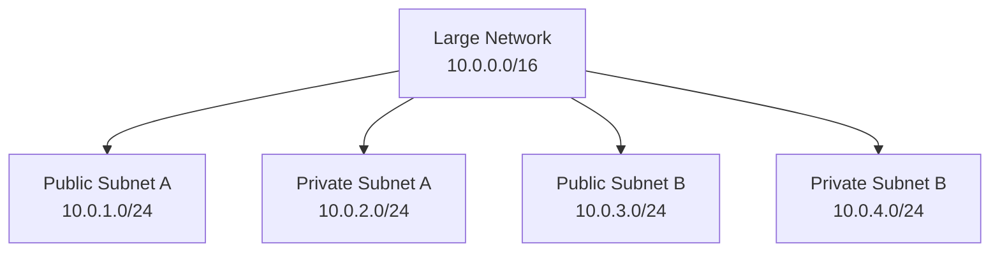
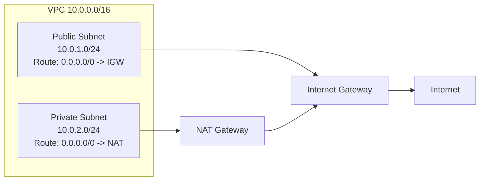

# Subnetting

Subnetting is the process of dividing one larger IP network into smaller networks called subnets.

Subnetting helps you organize devices, improve security boundaries, reduce unnecessary local traffic, and design networks that can grow cleanly.

## Visual Overview



## Why Subnetting Is Useful

Subnetting provides:

- Organization: group related resources together.
- Security: separate public resources from private databases.
- Scalability: reserve address space for future growth.
- Availability: place subnets in different availability zones.
- Routing control: give different subnets different route tables.
- Reduced broadcast scope: smaller networks limit local broadcast traffic.

## Basic Example

Start with this larger network:

```text
10.0.0.0/16
```

You can divide it into smaller `/24` subnets:

```text
10.0.1.0/24
10.0.2.0/24
10.0.3.0/24
10.0.4.0/24
```

Each `/24` subnet contains 256 total IPv4 addresses. In traditional IPv4 networking, two are normally reserved:

- Network address, such as `10.0.1.0`
- Broadcast address, such as `10.0.1.255`

That leaves 254 traditionally usable host addresses. Some cloud providers reserve additional addresses inside each subnet.

## Subnet Mask and CIDR

CIDR notation tells you how many bits are used for the network portion.

Example:

```text
10.0.1.0/24
```

This means:

- First 24 bits identify the network.
- Remaining 8 bits identify hosts.
- Total IPv4 addresses: `2^8 = 256`.

## Public and Private Subnet Design

A subnet is not public because of its IP range. A subnet is public because its route table has a route to an internet gateway.



Typical cloud design:

- Public subnet: load balancers, bastion hosts, NAT gateways.
- Private subnet: application servers, databases, internal services.

## Example AWS Layout

| Purpose | CIDR | Notes |
| --- | --- | --- |
| VPC | `10.0.0.0/16` | Main private network |
| Public subnet A | `10.0.1.0/24` | Internet-facing resources |
| Private app subnet A | `10.0.2.0/24` | Application servers |
| Private database subnet A | `10.0.3.0/24` | Databases |
| Public subnet B | `10.0.11.0/24` | Second availability zone |
| Private app subnet B | `10.0.12.0/24` | High availability |
| Private database subnet B | `10.0.13.0/24` | Database redundancy |

## How to Think About Subnet Size

Smaller prefix number means a larger network:

| CIDR | Total Addresses | Typical Use |
| --- | --- | --- |
| `/16` | 65,536 | Large VPC or corporate network |
| `/20` | 4,096 | Large subnet |
| `/24` | 256 | Common subnet size |
| `/27` | 32 | Small subnet |
| `/28` | 16 | Very small subnet |

Plan subnets with future growth in mind. A subnet that is too small can become painful to change later.

## Common Beginner Mistakes

- Thinking a subnet is public only because it uses a certain CIDR block.
- Creating overlapping subnets, such as `10.0.1.0/24` and `10.0.1.128/25`, in the same routing domain.
- Making subnets too small for cloud services that reserve multiple IP addresses.
- Mixing public web servers and private databases in the same subnet without a clear reason.
