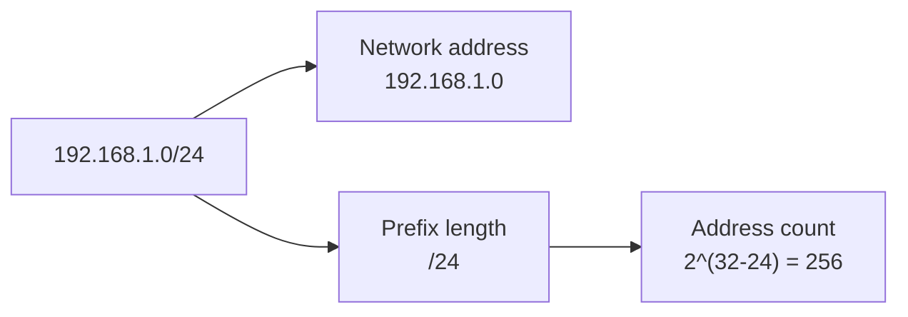

# CIDR Notation

CIDR stands for Classless Inter-Domain Routing. CIDR notation is a compact way to describe an IP network and its size.

Example:

```text
192.168.1.0/24
```

This means:

- Network address: `192.168.1.0`
- Prefix length: `/24`
- First 24 bits are the network portion.
- Remaining 8 bits are available for host addresses.

## Visual Overview



## How CIDR Prefixes Work

IPv4 addresses have 32 bits. The CIDR prefix tells you how many bits belong to the network.

```text
Total IPv4 bits: 32
CIDR prefix:     /24
Host bits:       32 - 24 = 8
Total addresses: 2^8 = 256
```

The formula is:

```text
Total addresses = 2^(32 - prefix)
```

## Common CIDR Blocks

| CIDR | Total IPv4 Addresses | Notes |
| --- | ---: | --- |
| `/32` | 1 | One specific IP address |
| `/31` | 2 | Often used for point-to-point links |
| `/30` | 4 | Small point-to-point subnet |
| `/29` | 8 | Very small subnet |
| `/28` | 16 | Small cloud subnet |
| `/27` | 32 | Small subnet |
| `/26` | 64 | Medium-small subnet |
| `/25` | 128 | Half of a `/24` |
| `/24` | 256 | Common LAN or subnet size |
| `/20` | 4,096 | Large subnet |
| `/16` | 65,536 | Common VPC size |
| `/8` | 16,777,216 | Very large network |

## CIDR and Subnet Masks

CIDR and subnet masks describe the same idea in different formats.

| CIDR | Subnet Mask |
| --- | --- |
| `/8` | `255.0.0.0` |
| `/16` | `255.255.0.0` |
| `/24` | `255.255.255.0` |
| `/25` | `255.255.255.128` |
| `/26` | `255.255.255.192` |
| `/27` | `255.255.255.224` |
| `/28` | `255.255.255.240` |

## Example: `192.168.1.0/24`

| Item | Value |
| --- | --- |
| Network address | `192.168.1.0` |
| CIDR prefix | `/24` |
| Subnet mask | `255.255.255.0` |
| Total addresses | 256 |
| First traditional usable host | `192.168.1.1` |
| Last traditional usable host | `192.168.1.254` |
| Broadcast address | `192.168.1.255` |

## Example: Cloud VPC and Subnets

```text
VPC:             10.0.0.0/16
Public subnet:   10.0.1.0/24
Private subnet:  10.0.2.0/24
Database subnet: 10.0.3.0/24
```

The `/16` VPC is the larger address space. The `/24` subnets are smaller networks created inside it.

## Common Beginner Mistakes

- Thinking `/24` means 24 addresses. It means 24 network bits.
- Forgetting that a larger prefix number creates a smaller network.
- Confusing a host IP, such as `192.168.1.10/24`, with the network address, `192.168.1.0/24`.
- Ignoring provider-specific reserved IP addresses in cloud subnets.
