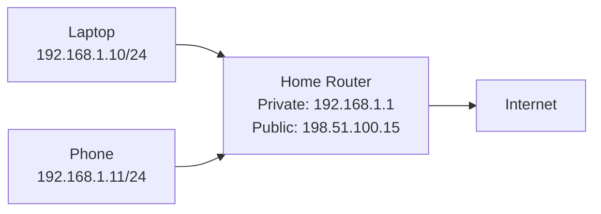
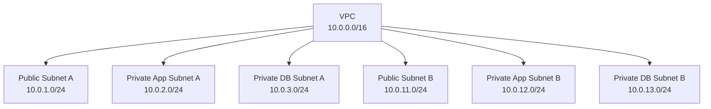

# IP Addressing Examples

This file provides practical examples for IP addresses, CIDR notation, public/private addresses, and subnetting.

## Example 1: Home Network



| Item | Value |
| --- | --- |
| Network | `192.168.1.0/24` |
| Router/default gateway | `192.168.1.1` |
| Laptop | `192.168.1.10` |
| Phone | `192.168.1.11` |
| Public IP on router | `198.51.100.15` |

The laptop and phone use private IP addresses. When they access the internet, the router uses NAT so the traffic appears to come from the router's public IP.

## Example 2: Same Network or Different Network?

Assume subnet mask `/24`.

| Device A | Device B | Same Network? | Why |
| --- | --- | --- | --- |
| `192.168.1.10/24` | `192.168.1.20/24` | Yes | Both are in `192.168.1.0/24` |
| `192.168.1.10/24` | `192.168.2.20/24` | No | Different `/24` networks |
| `10.0.1.5/24` | `10.0.1.200/24` | Yes | Both are in `10.0.1.0/24` |
| `10.0.1.5/24` | `10.0.2.5/24` | No | One is in `10.0.1.0/24`, the other is in `10.0.2.0/24` |

If two devices are in different networks, they need a router to communicate.

## Example 3: `/24` Subnet Calculation

Address:

```text
192.168.10.45/24
```

Result:

| Item | Value |
| --- | --- |
| Network address | `192.168.10.0` |
| First traditional usable host | `192.168.10.1` |
| Last traditional usable host | `192.168.10.254` |
| Broadcast address | `192.168.10.255` |
| Total addresses | 256 |

## Example 4: `/26` Subnet Calculation

A `/26` has:

```text
32 - 26 = 6 host bits
2^6 = 64 total addresses
```

The `/26` subnets inside `192.168.1.0/24` are:

| Subnet | Range | Broadcast |
| --- | --- | --- |
| `192.168.1.0/26` | `192.168.1.0` to `192.168.1.63` | `192.168.1.63` |
| `192.168.1.64/26` | `192.168.1.64` to `192.168.1.127` | `192.168.1.127` |
| `192.168.1.128/26` | `192.168.1.128` to `192.168.1.191` | `192.168.1.191` |
| `192.168.1.192/26` | `192.168.1.192` to `192.168.1.255` | `192.168.1.255` |

Traditional usable hosts exclude the network and broadcast addresses in each subnet.

## Example 5: Simple AWS VPC Plan



| Resource | CIDR | Purpose |
| --- | --- | --- |
| VPC | `10.0.0.0/16` | Main cloud network |
| Public subnet A | `10.0.1.0/24` | Load balancer, NAT gateway |
| Private app subnet A | `10.0.2.0/24` | Application servers |
| Private DB subnet A | `10.0.3.0/24` | Databases |
| Public subnet B | `10.0.11.0/24` | High availability |
| Private app subnet B | `10.0.12.0/24` | High availability |
| Private DB subnet B | `10.0.13.0/24` | High availability |

This layout leaves gaps between subnet ranges so future subnets can be added without renumbering everything.

## Example 6: Public vs Private Cloud Instance

| Instance | Private IP | Public IP | Internet Reachable? |
| --- | --- | --- | --- |
| Web server | `10.0.1.20` | `54.x.x.x` | Yes, if route and firewall allow |
| App server | `10.0.2.20` | None | No direct inbound internet access |
| Database | `10.0.3.20` | None | No direct inbound internet access |

A private server can still access the internet for updates if it has a route through a NAT gateway. That does not make it publicly reachable from the internet.

## Quick Checks

- A `/24` has 256 total IPv4 addresses.
- A `/16` has 65,536 total IPv4 addresses.
- Private IP ranges are `10.0.0.0/8`, `172.16.0.0/12`, and `192.168.0.0/16`.
- Public subnets need a route to an internet gateway.
- Private subnets should not have a direct route to an internet gateway for outbound internet traffic.
