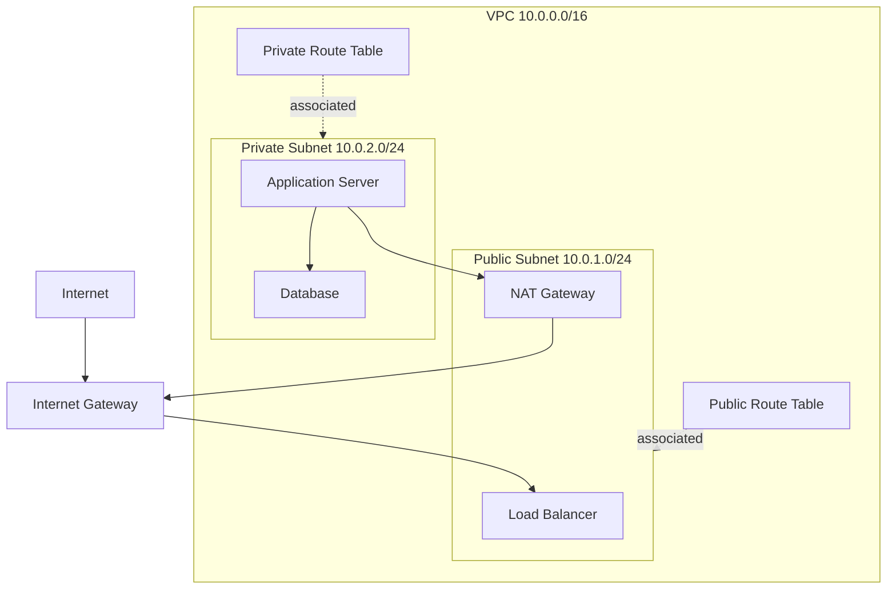

# VPC

VPC stands for Virtual Private Cloud. A VPC is a logically isolated network that you create inside a cloud provider.

In AWS, a VPC lets you control IP address ranges, subnets, routing, internet access, firewall rules, and how cloud resources communicate.

## Visual Overview



## What a VPC Provides

A VPC gives you control over:

- Private IP address range, such as `10.0.0.0/16`
- Subnets, such as `10.0.1.0/24` and `10.0.2.0/24`
- Route tables
- Internet gateways
- NAT gateways
- Security groups
- Network ACLs
- VPC peering, VPNs, and private connectivity

## VPC CIDR Block

When you create a VPC, you choose a CIDR block.

Example:

```text
10.0.0.0/16
```

This gives the VPC 65,536 total IPv4 addresses before cloud-provider reservations.

Good VPC CIDR planning matters because overlapping IP ranges can make future connectivity difficult. For example, connecting two VPCs that both use `10.0.0.0/16` can cause routing conflicts.

## VPC Components

| Component | Purpose |
| --- | --- |
| VPC | Main isolated network boundary |
| Subnet | Smaller network inside a VPC |
| Route table | Controls where traffic is sent |
| Internet gateway | Allows public internet connectivity |
| NAT gateway | Lets private resources initiate outbound internet traffic |
| Security group | Stateful firewall attached to resources |
| Network ACL | Stateless firewall attached to subnets |

## Public and Private Areas

A common VPC design separates internet-facing and internal resources:

| Area | Typical Resources | Internet Access |
| --- | --- | --- |
| Public subnet | Load balancer, bastion host, NAT gateway | Direct route to internet gateway |
| Private subnet | Application servers, databases, internal services | No direct inbound internet route |

This separation reduces risk. Public-facing resources can receive traffic from users, while sensitive internal services stay private.

## VPC Traffic Flow Example

For a typical web application:

1. A user connects to a public load balancer.
2. The load balancer forwards traffic to application servers in private subnets.
3. Application servers connect to databases in private database subnets.
4. Private servers use a NAT gateway for outbound software updates.

## Benefits of a VPC

- Isolation from other cloud customers and networks
- Control over routing and subnet design
- Security boundaries for applications and databases
- Support for high availability across availability zones
- Ability to connect cloud networks with on-premises networks

## Common Beginner Mistakes

- Creating one large subnet instead of separating public, private, and database tiers.
- Choosing a CIDR range that overlaps with an office network or another VPC.
- Assuming a subnet is public only because it contains public IPs. The route table is what makes a subnet public.
- Putting databases in public subnets when they only need private access.
