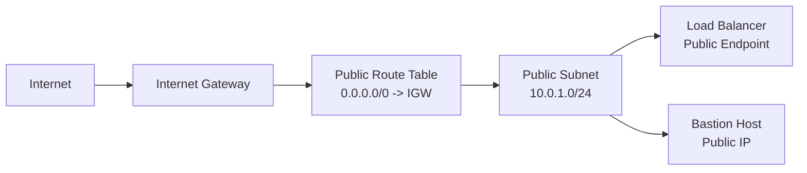
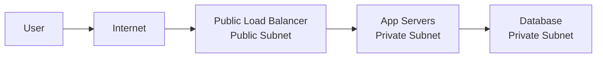

# Public Subnet

A public subnet is a subnet whose route table sends internet-bound traffic to an internet gateway.

In AWS, a resource in a public subnet is reachable from the internet only when all required conditions are true:

- The subnet route table has `0.0.0.0/0` pointing to an internet gateway.
- The resource has a public IPv4 address or equivalent public endpoint.
- Security group and network ACL rules allow the traffic.
- The operating system firewall allows the traffic.

## Visual Overview



## Public Subnet Route Table

Example public subnet:

```text
Subnet CIDR: 10.0.1.0/24
```

Example route table:

| Destination | Target | Meaning |
| --- | --- | --- |
| `10.0.0.0/16` | Local | Route traffic inside the VPC |
| `0.0.0.0/0` | Internet Gateway | Route internet-bound IPv4 traffic |

The `0.0.0.0/0` destination means "any IPv4 address not matched by a more specific route."

## Common Resources in Public Subnets

Public subnets are usually used for resources that must directly interact with the internet:

- Public load balancers
- NAT gateways
- Bastion hosts
- VPN endpoints
- Public reverse proxies

Application servers and databases usually do not need to be placed in public subnets.

## Public Subnet Does Not Mean Open Subnet

A public subnet provides a path to the internet. It does not automatically allow all traffic.

Traffic is still controlled by:

- Security groups
- Network ACLs
- Host firewalls
- Application configuration

For example, an EC2 instance in a public subnet with a public IP is not reachable over SSH unless its security group allows TCP port `22` from the source IP.

## Example: Web Load Balancer

A common production pattern is:



The load balancer is public because users need to reach it. The application servers and database can remain private.

## Common Beginner Mistakes

- Thinking any resource in a public subnet is automatically reachable from the internet.
- Giving public IP addresses to databases.
- Allowing SSH or RDP from `0.0.0.0/0` instead of using a restricted admin IP or safer access method.
- Forgetting that a public subnet needs a route to an internet gateway.
