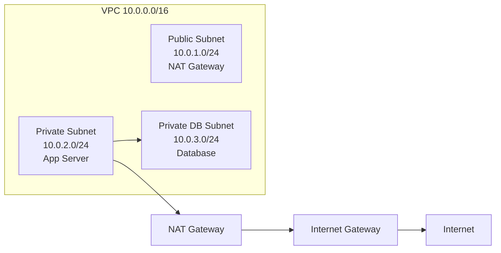
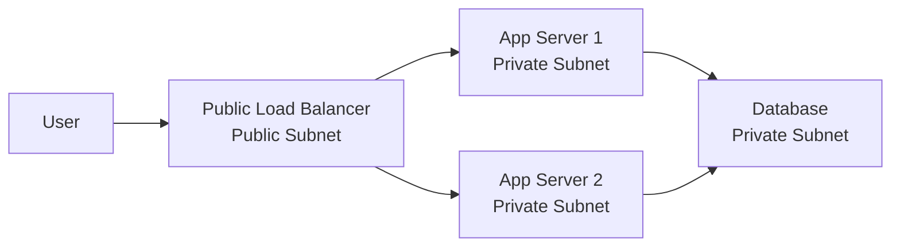

# Private Subnet

A private subnet is a subnet that does not have a direct route from the internet to its resources.

Private subnets are used for resources that should not be directly reachable by public users, such as application servers, databases, caches, and internal services.

## Visual Overview

## What Makes a Subnet Private?

A subnet is private when its route table does not send inbound and outbound internet traffic directly through an internet gateway.

Example private route table:

| Destination | Target | Meaning |
| --- | --- | --- |
| `10.0.0.0/16` | Local | Route traffic inside the VPC |
| `0.0.0.0/0` | NAT Gateway | Allow outbound internet access only |

The NAT gateway allows private instances to start outbound connections, such as downloading updates. It does not allow the internet to directly start connections to those private instances.

## Common Resources in Private Subnets

Private subnets are commonly used for:

- Application servers
- Databases
- Cache clusters
- Internal APIs
- Worker nodes
- Message queue consumers
- Kubernetes worker nodes

## Why Use Private Subnets?

Private subnets reduce direct exposure to the internet. This is an important security practice.

Benefits:

- Databases are not directly reachable from the internet.
- Application servers can sit behind a public load balancer.
- Internal services can be accessed only from approved networks.
- Outbound internet access can be centralized through NAT.

## Private Subnet with Load Balancer

In this design, users never connect directly to the application servers. They connect to the load balancer, and the load balancer forwards allowed traffic to private instances.

## Private Does Not Mean No Internet Access

A private subnet can still allow outbound internet access through:

- NAT gateway
- NAT instance
- Proxy server
- VPC endpoints for private access to cloud services

The important difference is direction. Private resources can initiate outbound connections, but public internet clients cannot directly initiate inbound connections to them.

## Common Beginner Mistakes

- Thinking private subnets cannot access the internet at all.
- Placing a NAT gateway inside a private subnet. A NAT gateway normally belongs in a public subnet.
- Giving public IP addresses to resources intended to be private.
- Allowing database security groups to accept traffic from the whole VPC when only application servers need access.
