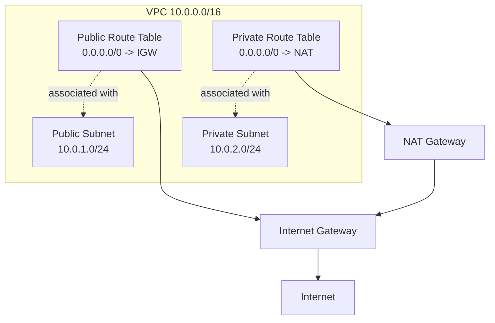

# Route Tables

A route table is a set of rules that tells network traffic where to go.

In a cloud VPC, each subnet is associated with a route table. When a resource sends traffic, the route table determines the next hop based on the destination IP address.

## Visual Overview



## What a Route Contains

A route usually has two main parts:

| Field | Meaning |
| --- | --- |
| Destination | The IP range the route applies to |
| Target | Where matching traffic should be sent |

Example:

| Destination | Target |
| --- | --- |
| `10.0.0.0/16` | Local |
| `0.0.0.0/0` | Internet Gateway |

## Local Route

Every VPC route table has a local route for the VPC CIDR.

Example:

```text
10.0.0.0/16 -> local
```

This allows resources inside the VPC to communicate with each other using private IP addresses, as long as security rules allow it.

## Default Route

The default route matches all IPv4 destinations that are not matched by a more specific route.

```text
0.0.0.0/0
```

Common default route targets:

| Target | Used For |
| --- | --- |
| Internet gateway | Public subnet internet access |
| NAT gateway | Private subnet outbound internet access |
| Virtual private gateway | VPN connection |
| Transit gateway | Central routing between networks |

## Longest Prefix Match

Routers choose the most specific matching route. This is called longest prefix match.

Example route table:

| Destination | Target |
| --- | --- |
| `10.0.0.0/16` | Local |
| `10.0.2.0/24` | Firewall appliance |
| `0.0.0.0/0` | Internet gateway |

Traffic to `10.0.2.15` matches both `10.0.0.0/16` and `10.0.2.0/24`, but `10.0.2.0/24` is more specific, so it wins.

## Public vs Private Route Tables

### Public Route Table

| Destination | Target |
| --- | --- |
| `10.0.0.0/16` | Local |
| `0.0.0.0/0` | Internet Gateway |

Associated with public subnets.

### Private Route Table

| Destination | Target |
| --- | --- |
| `10.0.0.0/16` | Local |
| `0.0.0.0/0` | NAT Gateway |

Associated with private subnets that need outbound internet access.

## Route Tables and Security

Route tables decide where traffic goes. They do not decide whether traffic is allowed.

Traffic can still be blocked by:

- Security groups
- Network ACLs
- Host firewalls
- Application configuration

Routing and firewall rules must both be correct for communication to work.

## Common Beginner Mistakes

- Associating a private subnet with a public route table.
- Forgetting that every subnet must be associated with a route table.
- Assuming route tables replace security groups.
- Missing the return path for traffic in more advanced network designs.
