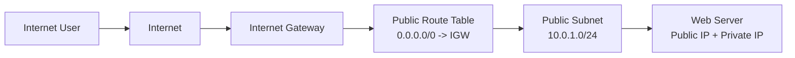
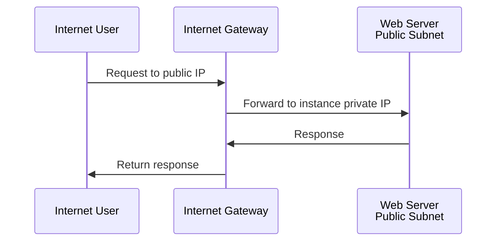

# Internet Gateway

An internet gateway is a VPC component that allows communication between resources in a VPC and the public internet.

In AWS, an internet gateway is horizontally scaled, redundant, and attached to a VPC. A subnet becomes public when its route table sends internet-bound traffic to the internet gateway.

## Visual Overview

## What an Internet Gateway Does

An internet gateway enables:

- Outbound traffic from public resources to the internet
- Inbound traffic from the internet to public resources
- Public IPv4 communication when the instance or service has a public IP

It does not automatically open all traffic. Security groups, network ACLs, and host firewalls still control what is allowed.

## Requirements for Public Internet Access

For an EC2 instance to be reachable from the internet over IPv4, these conditions are typically required:

1. The VPC has an attached internet gateway.
2. The subnet route table has `0.0.0.0/0 -> internet gateway`.
3. The instance has a public IPv4 address or Elastic IP.
4. The security group allows the required inbound traffic.
5. The network ACL allows the traffic.
6. The operating system firewall allows the traffic.
7. The application is listening on the expected port.

If any of these are missing, the instance may not be reachable.

## Example Public Route Table

| Destination | Target | Purpose |
| --- | --- | --- |
| `10.0.0.0/16` | Local | VPC internal traffic |
| `0.0.0.0/0` | Internet Gateway | Internet-bound traffic |

## Internet Gateway vs NAT Gateway

| Feature | Internet Gateway | NAT Gateway |
| --- | --- | --- |
| Used by | Public subnets | Private subnets |
| Allows inbound internet connections | Yes, when security allows | No |
| Allows outbound internet connections | Yes | Yes |
| Requires public IP on instance | Yes for direct IPv4 access | No |
| Common use | Public load balancer, bastion host | Private server updates |

## Common Traffic Flow

## Common Beginner Mistakes

- Attaching an internet gateway but forgetting the route table entry.
- Adding a public route but forgetting to assign a public IP to the resource.
- Opening security groups too broadly, such as SSH from `0.0.0.0/0`.
- Assuming an internet gateway is needed for private VPC-to-VPC traffic. Private connectivity can use peering, transit gateways, VPNs, or private links.
