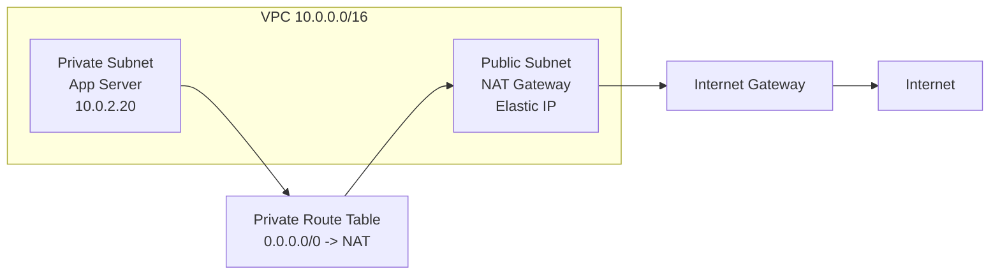
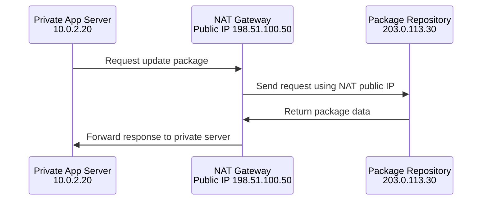
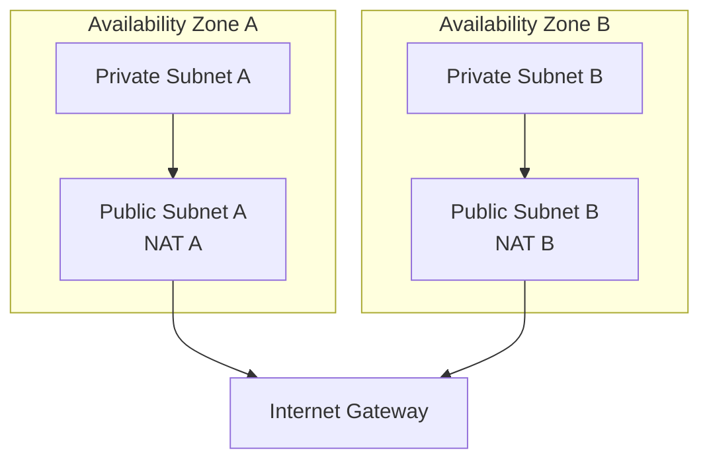

# NAT Gateway

A NAT gateway allows resources in a private subnet to initiate outbound connections to the internet while preventing the internet from directly initiating connections back to those private resources.

NAT stands for Network Address Translation.

## Visual Overview

## Why NAT Gateways Are Used

Private servers often need outbound internet access for:

- Operating system updates
- Package downloads
- Container image pulls
- External API calls
- License checks
- Monitoring agent communication

But those servers should not be directly reachable from the internet. A NAT gateway solves this by allowing outbound connections only.

## How NAT Works

The external server sees the NAT gateway's public IP, not the private server's IP.

## Required Route Tables

### Private Subnet Route Table

| Destination | Target |
| --- | --- |
| `10.0.0.0/16` | Local |
| `0.0.0.0/0` | NAT Gateway |

### Public Subnet Route Table

| Destination | Target |
| --- | --- |
| `10.0.0.0/16` | Local |
| `0.0.0.0/0` | Internet Gateway |

The NAT gateway must be placed in a public subnet because it needs a path to the internet gateway.

## NAT Gateway vs NAT Instance

| Feature | NAT Gateway | NAT Instance |
| --- | --- | --- |
| Managed by cloud provider | Yes | No |
| Scaling | Managed automatically within service limits | You manage instance size |
| Maintenance | Provider managed | You patch and maintain |
| Security groups | Not attached directly in AWS | Attached to instance |
| Common recommendation | Preferred for production | Used for custom control or lower-cost labs |

## High Availability Design

For production, use one NAT gateway per availability zone and route each private subnet to the NAT gateway in the same zone.

This avoids routing all private subnet traffic through a NAT gateway in a different availability zone.

## NAT Gateway Does Not Allow Inbound Access

A NAT gateway is not a bastion host and not a public entry point. You cannot SSH through a NAT gateway into private instances.

For administrative access to private instances, use safer options such as:

- Systems Manager Session Manager
- VPN
- Bastion host with strict access controls
- Private connectivity from an office network

## Common Beginner Mistakes

- Placing the NAT gateway in a private subnet.
- Forgetting the public subnet route to the internet gateway.
- Thinking NAT allows inbound internet access to private servers.
- Using one NAT gateway for multiple availability zones without understanding availability and data transfer tradeoffs.
