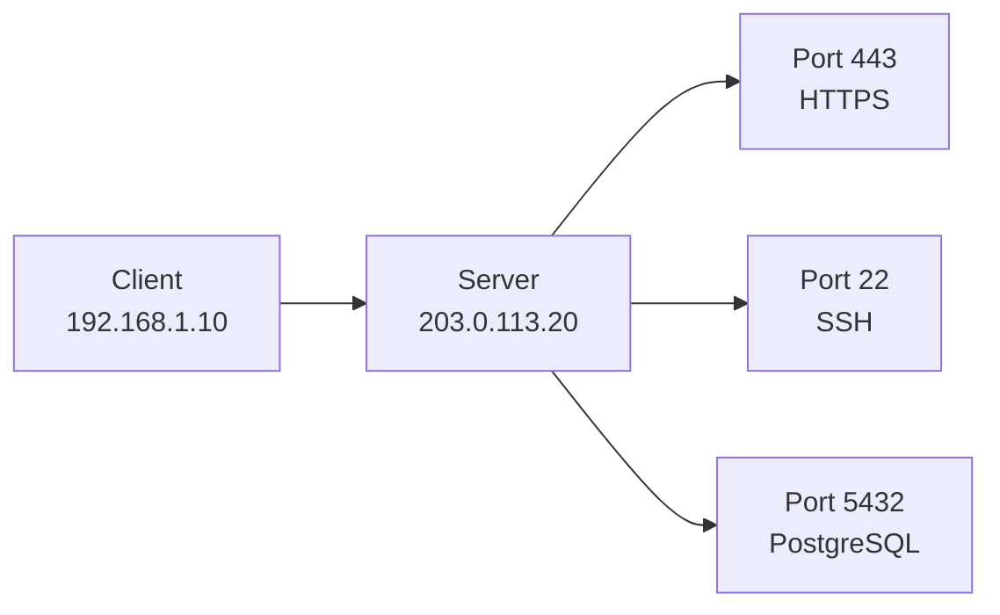

# Ports

A port is a number that identifies a specific application or service on a device.

An IP address gets traffic to the correct machine. A port gets traffic to the correct program on that machine.

## Visual Overview



## Why Ports Are Needed

A server can run many services at the same time:

- A web server on port `443`
- SSH access on port `22`
- A database on port `5432`
- A monitoring agent on another port

Without ports, the operating system would not know which application should receive incoming traffic.

## Port Ranges

| Range | Name | Common Use |
| --- | --- | --- |
| `0` to `1023` | Well-known ports | Common system services |
| `1024` to `49151` | Registered ports | Vendor and application services |
| `49152` to `65535` | Dynamic/private ports | Temporary client-side ports |

When your browser connects to `https://example.com`, the destination port is usually `443`. Your computer also chooses a temporary source port for the return traffic.

## Example Connection

```text
Client: 192.168.1.10:51544
Server: 203.0.113.20:443
```

This means:

- Client IP: `192.168.1.10`
- Client source port: `51544`
- Server IP: `203.0.113.20`
- Server destination port: `443`

The combination of source IP, source port, destination IP, destination port, and protocol identifies a network conversation.

## Common Ports

| Port | Protocol | Service |
| ---: | --- | --- |
| `22` | TCP | SSH |
| `25` | TCP | SMTP |
| `53` | UDP/TCP | DNS |
| `80` | TCP | HTTP |
| `123` | UDP | NTP |
| `443` | TCP | HTTPS |
| `3306` | TCP | MySQL |
| `5432` | TCP | PostgreSQL |
| `6379` | TCP | Redis |
| `27017` | TCP | MongoDB |

## Common Beginner Mistakes

- Thinking an open port always means the service is safe.
- Opening admin ports such as SSH or RDP to the whole internet.
- Forgetting that firewalls can block traffic even when the application is running.
- Confusing source ports with destination ports.
