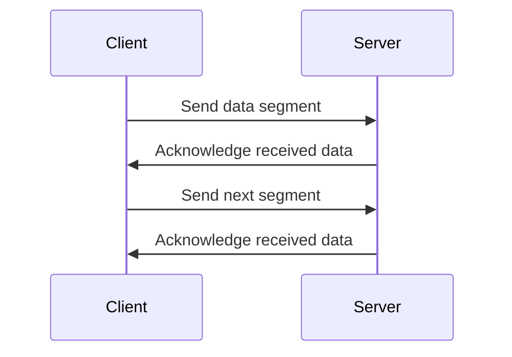

# TCP

TCP stands for Transmission Control Protocol. It is a reliable, connection-oriented transport protocol.

TCP is used when applications need data to arrive completely and in order.

## What TCP Provides

TCP provides:

- Connection setup
- Ordered delivery
- Acknowledgements
- Retransmission of lost data
- Flow control
- Congestion control

## Visual Overview

## Common TCP Use Cases

TCP is used by:

- HTTP and HTTPS
- SSH
- Email protocols
- Database connections
- File transfers
- Most API communication

## Reliability

TCP uses sequence numbers and acknowledgements to track data.

If a segment is lost, TCP can retransmit it. This makes TCP reliable but adds more overhead than UDP.

## TCP vs Application Errors

A successful TCP connection only proves that two systems can communicate at the transport layer. The application can still fail.

Example:

- TCP connection to port `443` succeeds.
- HTTPS certificate validation fails.
- The website returns HTTP `500`.

These are different layers of the problem.

## Common Beginner Mistakes

- Thinking TCP guarantees the application will work.
- Ignoring latency and packet loss when troubleshooting slow TCP connections.
- Forgetting that TCP needs both outbound and return traffic to be allowed.
