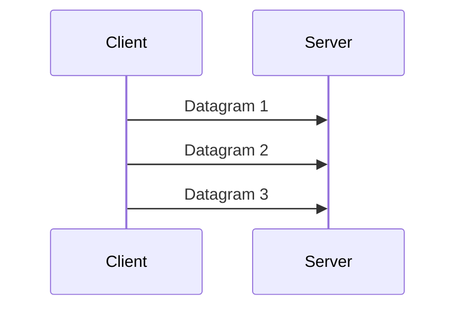

# UDP

UDP stands for User Datagram Protocol. It is a lightweight, connectionless transport protocol.

UDP does not create a connection before sending data. It sends datagrams without built-in delivery guarantees.

## What UDP Provides

UDP provides:

- Low overhead
- Fast transmission
- No built-in acknowledgement
- No built-in retransmission
- No built-in ordering guarantee

Applications that use UDP must handle reliability themselves if they need it.

## Visual Overview

There is no required handshake before sending UDP data.

## Common UDP Use Cases

UDP is used by:

- DNS queries
- NTP time synchronization
- Voice and video calls
- Online gaming
- Streaming
- Some VPN protocols

## Why Use UDP?

UDP is useful when speed matters more than perfect delivery.

For example, in a live voice call, retransmitting old audio packets may be useless because the conversation has already moved on. It is better to continue with the newest audio.

## TCP vs UDP

| Feature | TCP | UDP |
| --- | --- | --- |
| Connection setup | Yes | No |
| Reliability | Built in | Not built in |
| Ordering | Built in | Not built in |
| Overhead | Higher | Lower |
| Common use | Web, SSH, databases | DNS, voice, video, gaming |

## Common Beginner Mistakes

- Thinking UDP is always unreliable in practice. Some applications add their own reliability.
- Blocking UDP completely and then wondering why DNS, VPNs, or real-time apps fail.
- Assuming UDP is always faster for every workload.
