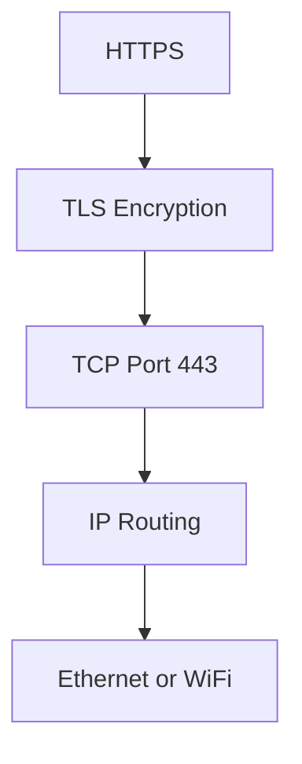

# Common Protocols

A protocol is a set of rules that systems follow to communicate.

Different protocols solve different problems: websites, name resolution, remote login, email, time synchronization, and file transfer all use different communication rules.

## Common Protocol Table

| Protocol | Port | Transport | Purpose |
| --- | ---: | --- | --- |
| HTTP | `80` | TCP | Hypertext Transfer Protocol; unencrypted web traffic |
| HTTPS | `443` | TCP | Hypertext Transfer Protocol Secure; encrypted web traffic using TLS |
| DNS | `53` | UDP/TCP | Domain Name System; name resolution |
| SSH | `22` | TCP | Secure Shell; secure remote login |
| SMTP | `25` | TCP | Simple Mail Transfer Protocol; sends email between mail servers |
| IMAP | `143` | TCP | Internet Message Access Protocol; reads email |
| IMAPS | `993` | TCP | IMAP over TLS; secure email reading |
| POP3 | `110` | TCP | Post Office Protocol version 3; downloads email |
| NTP | `123` | UDP | Network Time Protocol; time synchronization |
| DHCP | `67/68` | UDP | Dynamic Host Configuration Protocol; automatic IP configuration |
| FTP | `20/21` | TCP | File Transfer Protocol; file transfer |
| MySQL | `3306` | TCP | MySQL database |
| PostgreSQL | `5432` | TCP | PostgreSQL database |

## Protocol Stack Example

When you visit an HTTPS website, multiple protocols work together. HTTPS means Hypertext Transfer Protocol Secure. It uses TLS, or Transport Layer Security, for encryption. TLS uses TCP for reliable delivery, TCP uses IP for routing, and IP uses Ethernet or WiFi for local delivery.

## Important Distinction

Ports and protocols are related but not the same.

- A protocol defines communication rules.
- A port identifies where a service listens.

For example, HTTPS usually uses TCP port `443`, but port `443` alone does not magically make traffic secure. The application must actually use TLS and HTTPS correctly.

## Common Beginner Mistakes

- Memorizing port numbers without understanding what the protocol does.
- Assuming every protocol uses only one transport. DNS commonly uses UDP, but it can also use TCP.
- Thinking HTTPS is only HTTP on a different port. HTTPS adds encryption with TLS.
