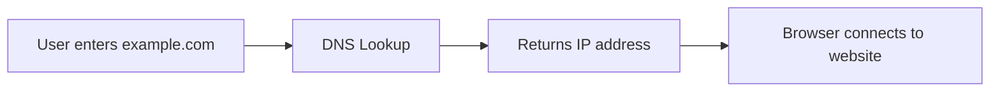

# What is DNS?

DNS stands for Domain Name System. It translates human-friendly names into IP addresses.

People prefer names such as `example.com`. Networks route traffic using IP addresses such as `93.184.216.34`. DNS connects those two worlds.

## Visual Overview



## Why DNS Matters

DNS is used almost everywhere:

- Opening websites
- Calling APIs
- Sending email
- Connecting microservices
- Finding cloud load balancers
- Service discovery in Kubernetes

If DNS fails, many applications look broken even when servers and networks are healthy.

## Domain Name Structure

```text
www.example.com
```

| Part | Meaning |
| --- | --- |
| `www` | Subdomain or host |
| `example` | Domain |
| `com` | Top-level domain |

DNS is hierarchical. The lookup process can involve root servers, top-level domain servers, authoritative name servers, and recursive resolvers.

## DNS Is Not the Same as HTTP

DNS finds the IP address. HTTP or HTTPS is used after that to request web content.

```text
DNS: What IP address belongs to example.com?
HTTPS: Please send me the web page from that IP address.
```

## Common Beginner Mistakes

- Thinking DNS hosts the website. DNS only points names to destinations.
- Forgetting DNS records can be cached.
- Updating a DNS record and expecting every user to see the change instantly.
