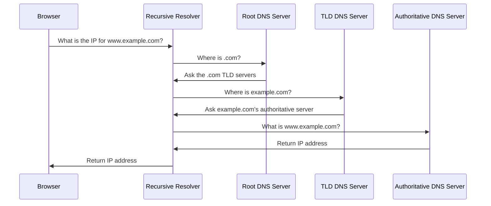

# DNS Resolution

DNS resolution is the process of converting a domain name into an IP address.

## Visual Overview



## Main DNS Participants

| Component | Role |
| --- | --- |
| Stub resolver | DNS client on your device |
| Recursive resolver | Performs the lookup on behalf of the client |
| Root server | Points to top-level domain servers |
| TLD server | Points to authoritative servers for domains |
| Authoritative server | Holds the actual DNS records for a domain |

## DNS Caching

DNS results are cached to improve performance and reduce load.

Caching can happen at:

- Browser
- Operating system
- Local router
- Recursive resolver
- ISP resolver

Each DNS record has a TTL, or Time To Live. TTL tells resolvers how long they can cache the answer.

## Example

When a user opens `www.example.com`:

1. The browser checks its cache.
2. The operating system checks its DNS cache.
3. The configured resolver is asked.
4. The resolver finds the answer through the DNS hierarchy if needed.
5. The IP address is returned.
6. The browser connects to the server.

## Common DNS Troubleshooting

Useful checks:

```text
nslookup example.com
dig example.com
dig A example.com
dig CNAME www.example.com
```

When troubleshooting DNS, check:

- Is the record correct?
- Has the TTL expired?
- Are you querying the expected resolver?
- Is the authoritative name server configured correctly?
- Is the application using an old cached answer?

## Common Beginner Mistakes

- Ignoring DNS cache when testing changes.
- Checking only one resolver and assuming all users see the same result.
- Confusing authoritative DNS problems with web server problems.
