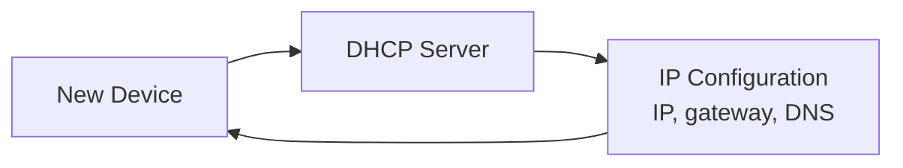

# What is DHCP?

DHCP stands for Dynamic Host Configuration Protocol. It automatically gives devices the network settings they need to communicate.

Without DHCP, administrators would need to manually configure IP settings on every device.

## What DHCP Provides

DHCP can provide:

- IP address
- Subnet mask
- Default gateway
- DNS servers
- Lease duration
- Additional network options

## Visual Overview

## Example DHCP Configuration

| Setting | Example |
| --- | --- |
| IP address | `192.168.1.25` |
| Subnet mask | `255.255.255.0` |
| Default gateway | `192.168.1.1` |
| DNS server | `192.168.1.1` or `8.8.8.8` |
| Lease time | 24 hours |

## DHCP Lease

A DHCP lease is temporary. The device can use the assigned IP address for a specific time.

Before the lease expires, the device tries to renew it. If renewal fails, the device may eventually lose that IP address and request a new one.

## Where DHCP Runs

DHCP can run on:

- Home routers
- Office routers
- Dedicated DHCP servers
- Cloud networks
- Virtual network appliances

## Common Beginner Mistakes

- Manually assigning an IP address inside the DHCP pool, causing conflicts.
- Forgetting to configure the correct default gateway.
- Assuming DHCP only gives IP addresses. It also provides DNS and other settings.
