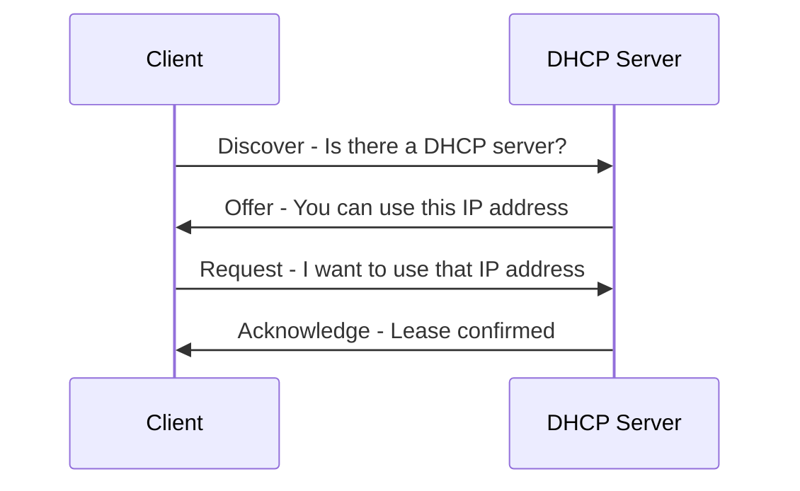

# DHCP DORA Process

DORA describes the four main messages used when a device gets an IP address from DHCP:

1. Discover
2. Offer
3. Request
4. Acknowledge

## Visual Overview

## Step 1: Discover

The client broadcasts a DHCP Discover message because it does not yet know the DHCP server's address.

The client is asking: "Is there a DHCP server on this network?"

## Step 2: Offer

The DHCP server responds with an offer.

The offer can include:

- IP address
- Subnet mask
- Default gateway
- DNS server
- Lease time

## Step 3: Request

The client requests the offered address.

This confirms that the client wants to use the offered configuration.

## Step 4: Acknowledge

The DHCP server sends an acknowledgement. The client can now use the assigned IP configuration.

## DHCP Relay

DHCP broadcast messages normally stay inside the local network. If the DHCP server is on another network, a DHCP relay can forward DHCP messages between the client subnet and the DHCP server.

## Common Beginner Mistakes

- Forgetting that DHCP depends on broadcast traffic during initial discovery.
- Not configuring DHCP relay when the server is on a different subnet.
- Troubleshooting internet access before checking whether the client received an IP, gateway, and DNS server.
