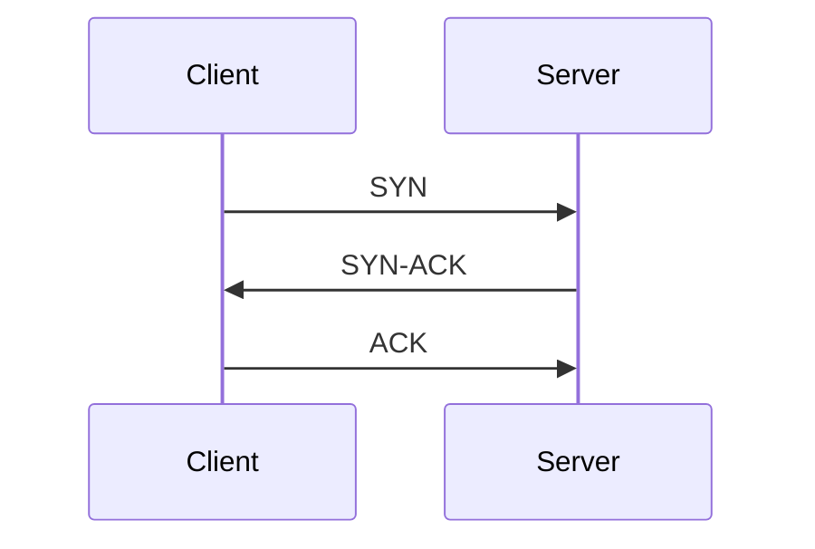

# TCP Three-Way Handshake

The TCP three-way handshake establishes a TCP connection before data is exchanged.

It confirms that both sides can send and receive traffic.

TCP stands for Transmission Control Protocol. The handshake uses TCP flags: SYN means synchronize, ACK means acknowledgement, and SYN-ACK means the server is both synchronizing and acknowledging the client's request.

## Visual Overview

## Step 1: SYN

The client sends a SYN packet to the server.

Meaning: "I want to start a TCP connection."

## Step 2: SYN-ACK

The server replies with SYN-ACK.

Meaning: "I received your request and I am ready to establish the connection."

## Step 3: ACK

The client sends ACK.

Meaning: "I received your reply. The connection is established."

After this, application data can flow.

## Example

When your browser connects to an HTTPS website:

1. TCP handshake happens with destination port `443`.
2. TLS, or Transport Layer Security, performs its own handshake to establish encryption.
3. HTTP request is sent inside the encrypted connection.
4. The server returns the web response.

## Common Failure Points

| Symptom | Possible Cause |
| --- | --- |
| SYN sent, no SYN-ACK | Firewall, routing issue, server down |
| SYN-ACK received, ACK missing | Return path or client-side filtering issue |
| TCP works but HTTPS fails | TLS or application-layer issue |

## Common Beginner Mistakes

- Thinking a TCP handshake means the application is healthy.
- Forgetting that firewalls can block either direction.
- Confusing TCP handshake with TLS handshake.
