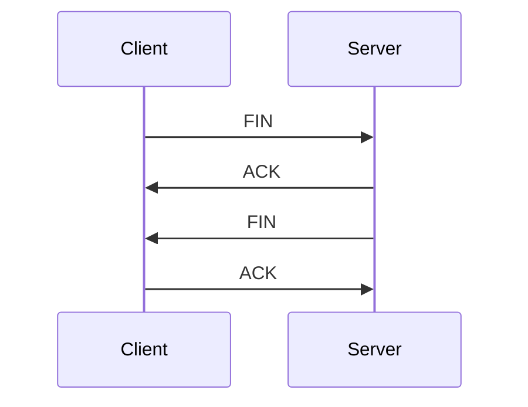

# TCP Connection Termination

TCP connections are normally closed using FIN and ACK packets. Either side can start the close process.

## Visual Overview

## Graceful Close

A graceful close means both sides finish sending data and acknowledge the connection shutdown.

The common flow is:

1. One side sends `FIN`.
2. The other side replies with `ACK`.
3. The other side sends its own `FIN`.
4. The first side replies with `ACK`.

## Reset Close

Sometimes a TCP connection is closed with `RST`, or reset.

This usually means the connection was aborted rather than gracefully closed.

Common reasons:

- Application crashed
- Port is closed
- Firewall rejected the connection
- Application intentionally reset the connection

## TIME_WAIT

After closing a TCP connection, one side may stay in `TIME_WAIT` for a short period. This helps ensure delayed packets from the old connection do not confuse a new connection.

`TIME_WAIT` is normal. It becomes a concern only when there are too many connections and the system runs out of available ports or resources.

## Common Beginner Mistakes

- Treating every `TIME_WAIT` as an error.
- Assuming `RST` always means a network device blocked traffic.
- Ignoring application logs when connection resets happen.
