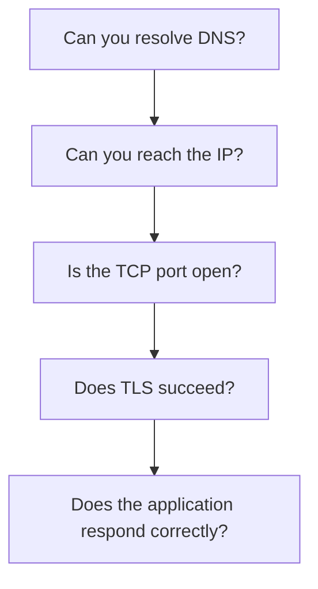

# TCP Troubleshooting

TCP troubleshooting is easier when you separate network reachability, transport connectivity, encryption, and application behavior.

Abbreviations used here:

- DNS: Domain Name System
- TCP: Transmission Control Protocol
- TLS: Transport Layer Security
- ICMP: Internet Control Message Protocol

## Troubleshooting Flow

## Useful Checks

| Check | Purpose |
| --- | --- |
| `ping` | Basic reachability, if ICMP is allowed |
| `traceroute` or `tracert` | Path visibility |
| `nc -vz host port` | TCP port connectivity |
| `curl -v https://host` | HTTP/TLS behavior |
| `dig host` | DNS lookup |
| `ss -tulpn` or `netstat` | Listening ports on a server |

## Common Symptoms

| Symptom | Likely Area |
| --- | --- |
| DNS name does not resolve | DNS |
| IP does not respond to ping | Routing, firewall, ICMP disabled |
| TCP connection times out | Firewall, routing, server not reachable |
| Connection refused | Host reachable but port closed |
| TLS certificate error | TLS or certificate configuration |
| HTTP `500` | Application problem |

## Layered Thinking

Do not jump straight to the application. Check in order:

1. DNS resolution
2. IP routing
3. Firewall and security rules
4. TCP port listening
5. TLS configuration
6. Application logs

## Common Beginner Mistakes

- Assuming ping failure always means the server is down.
- Ignoring security groups and network ACLs in cloud environments.
- Not checking whether the application is actually listening on the expected port.
