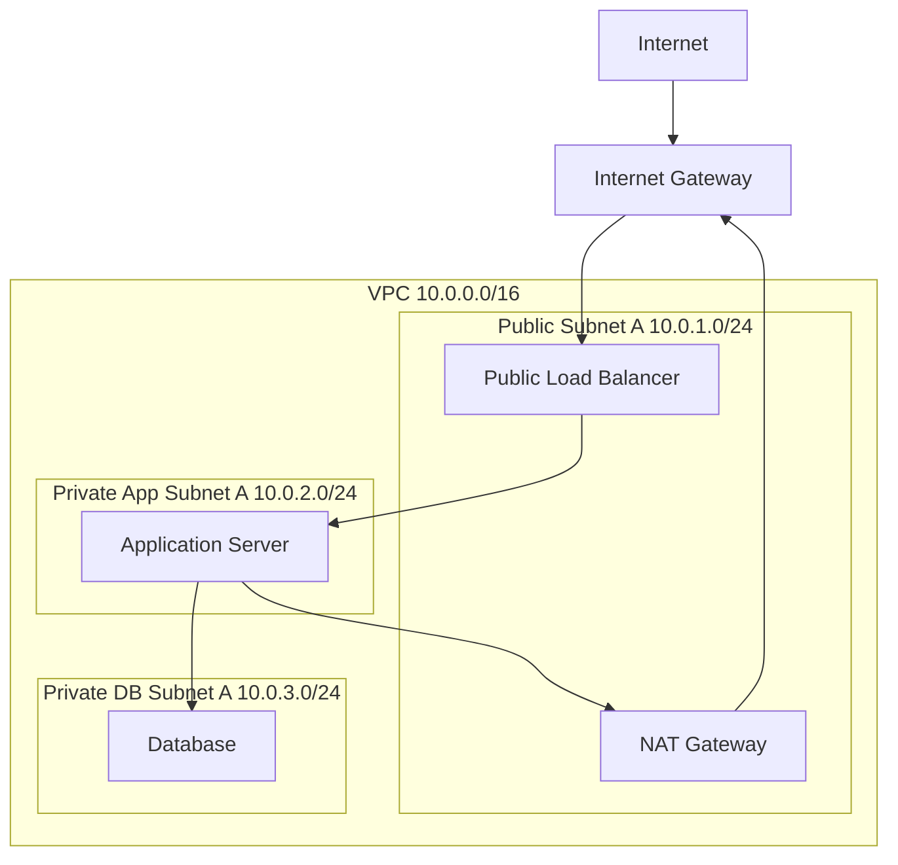

# Cloud VPC Diagram

This diagram shows a common cloud VPC layout with public and private subnets.

The load balancer is public. Application servers and databases remain private. Private servers use the NAT gateway for outbound internet access.
