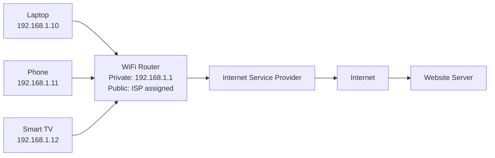

# Home Network Diagram

This diagram shows a simple home network.

```mermaid
flowchart LR
    Laptop["Laptop<br/>192.168.1.10"]
    Phone["Phone<br/>192.168.1.11"]
    TV["Smart TV<br/>192.168.1.12"]
    WiFi["WiFi Router<br/>Private: 192.168.1.1<br/>Public: ISP assigned"]
    ISP["Internet Service Provider"]
    Internet["Internet"]
    Website["Website Server"]

    Laptop --> WiFi
    Phone --> WiFi
    TV --> WiFi
    WiFi --> ISP
    ISP --> Internet
    Internet --> Website
```

The devices use private IP addresses inside the home. The router uses NAT when those devices access the internet.
